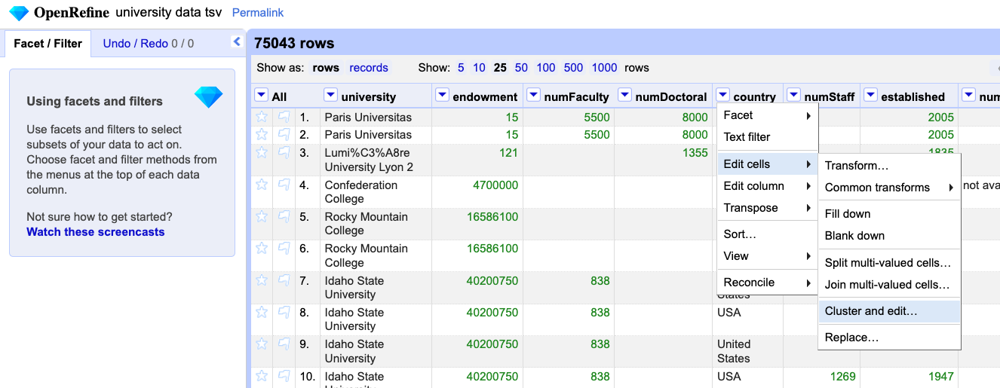

# OpenRefine Tutorial

Original source: <http://enipedia.tudelft.nl/wiki/OpenRefine-Tutorial> (*link no longer works*), written by David François Huynh, last updated 5 October 2017, at 15:03.

This document is a modification based on the version archived by the Internet Archive in January 2019, <http://web.archive.org/web/20190105063215/enipedia.tudelft.nl/wiki/OpenRefine-Tutorial>. Screenshots were re-generated in 2024 using OpenRefine 3.8.0. 

Questions were added in 2024 for CS 625 and are shown in the following style:
> [!NOTE]
> :rotating_light: **Q1:** How many rows are in the dataset?

## Overview

This is a tutorial on using [OpenRefine](https://openrefine.org) (formerly Google Refine), and has been developed to teach students in a statistics class how this tool can be used to clean up data.

The data used is **[university-data.tsv](university-data.tsv)**, a plain text TSV (tab-separated values) file. Save the file directly to your computer. Don't open it first in Excel, since saving it again may disturb the layout.

This dataset shows how we can use [Wikipedia](https://www.wikipedia.org) data to see *if there is a relationship between the number of students at a university and the size of the university's endowment*. The data is sourced from a SPARQL query to [DBpedia](https://www.dbpedia.org/) that extracts information about universities from Wikipedia infoboxes.

Resources:

* **Documentation** - <https://openrefine.org/docs> - Almost everything you need to know. Search Google and you'll find everything else.
* **OpenRefine Wiki** - [https://github.com/OpenRefine/OpenRefine/wiki](https://github.com/OpenRefine/OpenRefine/wiki) - This contains several videos that give an overview of the tool.
* **Advanced Documentation** - [Google Refine Expression Language (GREL) reference](https://openrefine.org/docs/manual/grel) - This shows how you can use a programming language to perform some very sophisticated tasks.

## What you can learn

The data contains quite a few issues, and this tutorial shows how to do things like:

* Cleaning up inconsistent spelling of terms (i.e. "USA", "U.S.A", "U.S.", etc).
* Converting values that are text descriptions of numeric values (i.e. $123 million) to actual numeric values (i.e. 123000000), so that they are usable for analysis.
* Identifying which rows of a specific column contain a search term
* Extracting and cleaning values for dates
* Removing duplicate rows
* Exporting cleaned data to Excel

## Setup Steps

### Installation

Download and install OpenRefine from <https://openrefine.org/download>.

OpenRefine runs in a web browser, and when you start it, it should automatically open up a web browser window. If this does not happen, open a web browser yourself and go to <http://127.0.0.1:3333>, and you should see it.

### Load file and create project

Click on **Create project**, then **Choose Files**. Select the file from your computer (university-data.tsv), then click on **Next >>**.

[](OpenRefine-LoadFile.png)

The data will be read in and a preview shown. Check the following settings in the bottom panel:

* checked - Use character " to enclose cells containing column separators
* checked - Trim leading & trailing whitespace from strings
* checked - Attempt to parse cell text into numbers
* unchecked - Store blank rows

Once your data looks similar to the image below (numbers shown in green text and not enclosed in quotation marks), you can name your project and click **Create project >>**.

[](OpenRefine-CreateProject.png)

The default view only shows 10 rows at a time. You probably want to see more, so click on **25** or **50** at the top to see more data.

[](OpenRefine-Rows.png)

> [!NOTE]
> :rotating_light: **Q1:** How many rows are in the dataset?

## Data Cleaning

As a reminder, the goal of this data cleaning is to see if there is a relationship between the number of students at a university and the size of the university's endowment.  So we'll mainly be focusing on cleaning the columns representing the number of students and the university's endowment.

### Country names

The data contains variants of the names for several countries. To fix this, use **Edit cells > Cluster and edit...** on the **country** column.

[](OpenRefine-ClusterAndEdit.png)

We already see an issue here where there is both the full name of a country (United States) and its abbreviation (US). To fix this, we can **copy/paste "United States" as the new cell value**. Make sure the **Merge?** box is checked for each. To finish, click **Merge selected & re-cluster**.

[](OpenRefine-ClusterAndEdit2.png)

It's not just the US that has different names specified for it. By using the different string comparison algorithms (choose a different method and/or keying function), you can find issues with other countries as well.

You can further explore the identified clusters. Hover over the cluster row and a "Browse this cluster" link will appear under the "Values in cluster" column. Click that link and a new window will open with just the rows in that cluster.

> [!NOTE]
> :rotating_light: **Q2:** *What other countries had issues with spelling? How did you find them?*

After using clustering to clean up the country names, explore the country names using a text facet. In the country column, choose "Facet > Text facet".

> [!NOTE]
> :rotating_light: **Q3:** How many different country names are listed?

Using the "edit" option, fix any remaining country name issues you find.

> [!NOTE]
> :rotating_light: **Q4:** What other countries did you edit using the text facet?  
> :rotating_light: **Q5:** How many different country names are now listed?

Sort the facet by count.

> [!NOTE]
> :rotating_light: **Q6:** How many universities are listed for the US? Does this number make sense?

We'll investigate this more later.

### Values for the number of students

Now, we need to clean the data for the number of students. Not all of the values are numeric, and many of them contain bits of text in addition to the actual number of the students.

To figure out which entries need to be fixed, we need to use a Numeric facet on the **numStudents** column:

[](OpenRefine-CreateNumericFacet.png)

This shows us a histogram of the values in the left panel, and also lists the number of entries per type (numeric, non-numeric, blank, error, etc). **Uncheck all types except for non-numeric**.

[](OpenRefine-SelectNonNumericValuesFromNumericFacet.png)

We can see some problems already, as some cells have "+" and "~" in them. To fix this, we need to do **Edit cells > Transform**

[](OpenRefine-TransformCells.png)

This allows us to now type in commands that can replace sequences of characters:

```grel
value.replace("~", "")
```

[](OpenRefine-TextTransform.png)

Also, if you see entries with strange symbols like "Lumi%C3%A8re University Lyon 2" in the **university** column (should be "Lumière University Lyon 2"), you can fix this via **Edit cells > Transform** with this command:

```grel
value.unescape('url')
```

In doing this, you're actually using bits of a programming language. A lot of advanced features are available (not covered in this tutorial), and if you want to understand this further, you can refer to the [Google Refine Expression Language (GREL) reference](https://openrefine.org/docs/manual/grel).

If you find multiple things that need to be replaced, you don't have to keep clicking **Edit cells > Transform** for every single issue. You can chain these commands together to fix several issues at once:

```grel
value.replace("+", "").replace(",","")
```

In order to update the selection of non-numeric values, it's sometimes necessary to convert the values of the columns to numbers using **Edit cells > Common transforms > To number**.

[](OpenRefine-ConvertToNumber.png)

Once you do this, you should see that there are fewer non-numeric values. More issues can be cleaned up using **Edit cells > Transform...**

```grel
value.replace(" total", "").replace(" -", "")
```

Note that after you do this, you'll need to apply the **To number** transform again to catch all of the newly cleaned numbers.

> [!NOTE]
> :rotating_light: **Q7:** How many non-numeric rows are left?

You can continue cleaning up the data, but for this exercise we will move on and remove all the rows that do not have numeric values for the number of students. To do this, ensure that your **numeric facet** has **non-numeric** and **blank** values checked. Then do **All > Edit rows > Remove all matching rows**.

[](OpenRefine-RemoveAllMatchingRows.png)

> [!NOTE]
> :rotating_light: **Q8:** How many rows are left in the dataset?

Before we move on, let's examine the range of values in the numStudents column.

> [!NOTE]
> :rotating_light: **Q9:** What is the maximum value in the numStudents column? Does this number make sense?  
> :rotating_light: **Q10:** What is the enrollment of the largest university in the world? (Look this up.)

Move the left slider in the numStudents numeric facet to the left so that the values shown are greater than 100,000,000.

Since this dataset came from Wikipedia, use Wikipedia to verify and correct the number of students at the universities that show more than 100 million students.

> [!NOTE]
> :rotating_light: **Q11:** What were the universities and what did you update?

We'll come back to this column later.

### Values for the endowment

It's possible to have multiple facets in use at once. When you do this, each additional facet makes a sub-selection of the data selected by the previous facet. If you find that the number of rows you have selected and are working with is smaller than expected, then check to see if you still have facets in use which are not needed any more.

First **remove the numeric facet for numStudents** (click the 'x' on the facet) and **create a new numeric facet for endowment**. Select only the **non-numeric** values, as was done for the number of students.

Already we see issues like "US$1.3 billion" and "US $186 million"

[](OpenRefine-EndowmentColumnMess.png)

Assuming that everything is in $ (a somewhat bogus assumption), we can clean up the data similarly to how we did it before. Click on the **endowment** column > **Edit cells > Transform**

```grel
value.replace("US $","").replace("US$", "")
```

Both "million" and "Million" are in the values, so it's useful to **convert all the values to lowercase** instead of cleaning this up twice. Use **Edit cells > Common transforms > To lowercase**

[](OpenRefine-ConvertToLowerCase.png)

Click on the endowment column again, and create a custom text facet to locate all the rows with the word "million" in them: **Facet > Custom text facet**

```grel
value.contains("million")
```

Once that's been added to your left panel, click **true** in the new facet to show only rows that are non-numeric and contain the term "million".

[](OpenRefine-CustomTextFacet.png)

> [!NOTE]
> :rotating_light: **Q12:** How many entries used the term "million" in the endowment column?

It's not advisable to just replace "million" by "000000" since you have some values like "$13.8 million", which would be converted to "$13.8000000". It's better to first remove "million" from the text, convert the remaining text to a number, and then multiply this by 1000000.  We can do this in a single GREL line in **Edit cells > Transform**.

```grel
toNumber(value.replace(" million", ""))*1000000
```

The term "billion" is in the values as well, so remove previous custom text facet for "million", and create a new one for "billion", and repeat process described above.

> [!NOTE]
> :rotating_light: **Q13:** How many entries used the term "billion" in the endowment column?

After most of this has been cleaned up, select the non-numeric values, and delete them, just as was done for the numStudents. (**All > Edit rows > Remove all matching rows**)

### Finding issues in other columns

OpenRefine has plenty of features that can help clean up the other columns as well. For example, if you do a text facet on the column with country names, you will find issues such as entries for both "England" and "England, UK", along with entries for Canada that contains parts of the university address. *You may have already addressed some of these earlier.*

[](OpenRefine-TextFacet.png)

### Cleaning up dates

The dates in the **established** column are a mess as well, but there's a few techniques that can be used to help clean them up.

First we want to convert everything to text - **Edit cells > Common transformations > To text**, and then you need to **Edit cells > Common transformations > To date**. If you did not convert all the values to text first, then you may find that some of the years are represented as numbers, and have not been converted.

If only a year is listed, then the date created will use January 1st as the month and day. We will clean this up later to use only the year.

To further clean up the dates, we need to use **Facet > Timeline facet** and select only **"Non-Time"** values. 

> [!NOTE]
> :rotating_light: **Q14:** How many of the established dates are non-time values?

This shows us that we have a bit of a tricky situation as years are mixed in with text such as "Established 1985". We need some way to recognize a sequence of four numbers in a section of text and extract only the numbers. To do this, we need to use [regular expressions](https://openrefine.org/docs/manual/expressions#regular-expressions). This is a very powerful technique that allows you to specify very complex patterns that you wish to match. For this tutorial, you don't need to know how to write regular expressions, but you should at least know that they exist, and that they can be used to help you with seemingly impossible tasks.

[](http://xkcd.com/208/)

*Regular Expressions*. Source:[XKCD](http://xkcd.com/208/), [CC BY-NC 2.5](http://creativecommons.org/licenses/by-nc/2.5/) license.

We now want to do **Edit cells > Transform**, and use the code below.

```grel
value.match(/.*(\d{4}).*/)[0]
```

Here's what the symbols mean:

* `.*` matches a sequence of zero or more characters (letters, numbers, symbols, etc)
* `\d` matches a digit, and `{4}` shows that we want to match exactly 4 digits
* `value.match()` returns an array of results, so we use `[0]` to retrieve only the first match
  
[](OpenRefine-CleanUpDates.png)

We can now **convert these extracted values to dates** using **Edit cells > Common transformations > To date**.

At this point, we've done almost everything we can to track down usable dates, and we now want to just **extract the years**. First, we need to select the **Time** entries in our Timeline Facet.  Then, we want to **Edit cells > Transform** with the code below:

```grel
value.toString('yyyy')
```

What's happening here is that we're using a string ('yyyy' in this case) to specify what parts of the date we want, and how it should be displayed. The [Java SimpleDateFormat documentation](https://docs.oracle.com/javase/8/docs/api/java/text/SimpleDateFormat.html) describes this in much more detail.

As illustrated in the table below, you can experiment with different commands to get different formats of dates.

|Command | Result |
| ---- | ---- |
|value.toString('M') | 1 |
|value.toString('MM') | 01 |
|value.toString('MMM') | Jan |
| value.toString('MMMM') | January |

As described in [GREL Date Functions](https://openrefine.org/docs/manual/grelfunctions#date-functions), you can use code such as that below to reformat multiple date formats into a single format.

```grel
value.toDate('MM/yy','MMM-yy').toString('yyyy-MM')
```

We're just going to leave the years here as text, so there's nothing else needed to do here.

### Deduplicate entries

There's a lot of (nearly) duplicate rows in the data. Why this happens is a bit of a long story, and is due to Wikipedia having things like multiple numbers of students listed for different years. When the data is retrieved, permutations of these values are returned. To make things simple, we want to just keep the first row of data for each university.

First, make sure that you close out any facets that you previously were using. The remaining procedure is based on the blogpost ["Remove duplicate rows"](http://googlerefine.blogspot.nl/2011/08/remove-duplicate.html).

**Click on the university column**, and then **click on "Sort"**. Sort by text, a-z, and click **OK**. Once you do this, you will notice that there is a **new "Sort" menu at the top**. Click on this and **select "Reorder rows permanently"**. This may take a while as it renumbers the rows in which the entries appear.

[](OpenRefine-ReorderRowsPermanently.png)

Then on the **university** column, do **Edit cells > Blank down**.  This will create a blank value in the **university** column for consecutive values.

[](OpenRefine-BlankDown.png)

Then still on the **university** column, do **Facet > Customized facets > Facet by blank**.

[](OpenRefine-FacetByBlank.png)

Now we want to remove all the blank rows, so select **true** in the facet to show all of the rows that have blank in the **university** column. Then on the **All** column, do **Edit rows > Remove all matching rows**, like you have done when working with the numStudents and endowment columns.

Then close all of the facets, and you now have a (mostly) cleaned data set.

> [!NOTE]
> :rotating_light: **Q15:** How many rows are remaining in the dataset?  
> :rotating_light: **Q16:** How many universities are listed as in the US? Is this more reasonable than your answer for **Q6**?

Finally, look back at the **numStudents** column. Investigate any US universities that have more students than the largest university in the world.

> [!NOTE]
> :rotating_light: **Q17:** What were the universities and what did you update?

## Exporting Data

The cleaned data can be exported to formats such as Excel using the **Export** menu at the top right.

Note: If you read this into a non-Excel tool and notice that the last column is missing, then open the file up in Excel, re-save it, and try to open it up again in your tool.

[](OpenRefine-ExportToExcel.png)
